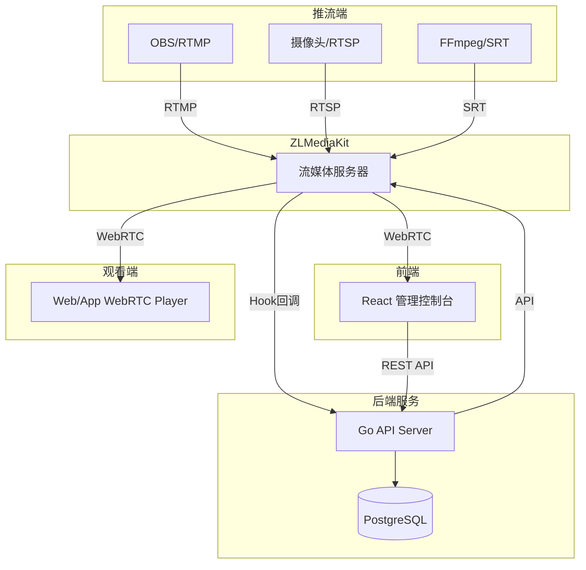

# 内网低延迟直播系统架构说明

## 1. 项目背景

本项目用于在 **内网环境** 部署一套 **低延迟直播系统**，满足以下需求：

- 支持多设备推流（摄像头 / OBS / FFmpeg）
- 支持管理端统一管理所有推流设备
- 管理端可实时观看任意推流画面
- 支持强制断流、推流码管理
- 观看端低延迟观看直播
- 自动检测"空流 / 无内容流"，并销毁推流码
- 全系统以 **低延迟（<200ms）** 为目标

---

## 2. 总体架构

```
┌────────────────┐
│    推流端      │
│ RTMP/SRT/RTSP  │
└───────┬────────┘
        │
        │ 推流接入
        ▼
┌──────────────────────────────┐
│        ZLMediaKit            │
│                              │
│  - 接收 RTMP / SRT / RTSP    │
│  - 转封装                    │
│  - WebRTC 分发               │
│  - Hook 回调                 │
│  - 流状态 API                │
└───────┬───────────────┬──────┘
        │               │
   WebRTC播放       HTTP API
        │               │
┌───────┴────────┐ ┌────┴──────────────────┐
│    观看端      │ │    管理后端服务 (Go)   │
│   Web / App    │ │                        │
│    WebRTC      │ │  - 推流码管理          │
└────────────────┘ │  - 流状态监控          │
                   │  - 空流检测            │
                   │  - 强制断流            │
                   │  - 用户认证            │
                   └────────┬───────────────┘
                            │
                   ┌────────┴───────────┐
                   │   管理端前端 (React) │
                   │     Web 控制台      │
                   └────────────────────┘
```

### 架构流程图 (Mermaid)



---

## 3. 核心技术选型

### 3.1 技术栈总览

| 层级 | 技术 | 说明 |
|------|------|------|
| **流媒体服务器** | ZLMediaKit | 支持多协议推流，WebRTC 分发 |
| **后端服务** | Go + Gin | 高性能 API 服务 |
| **数据库** | PostgreSQL | 存储推流码、设备、用户信息 |
| **缓存** | Redis | 会话管理、流状态缓存 |
| **前端** | React + TypeScript | 管理控制台 |
| **UI 组件** | Ant Design | 企业级 UI 组件库 |

### 3.2 流媒体服务器

**ZLMediaKit**

- 支持协议：
  - RTMP / RTSP / SRT（推流）
  - WebRTC（播放）
  - HLS / HTTP-FLV（可选）
- 特性：
  - WebRTC 低延迟（50~200ms）
  - 完整 HTTP API
  - Hook 回调（推流/断流/无人观看）
  - 支持主动踢流

> 本系统以 **WebRTC 作为观看端分发协议**，推流协议灵活。

---

### 3.3 推流协议策略

| 场景 | 协议 | 说明 |
|------|------|------|
| OBS / 人工推流 | RTMP | 兼容性最好 |
| 设备 / 摄像头 | RTSP | 设备原生支持 |
| 稳定传输 | SRT | 抗丢包能力强 |
| 内部统一分发 | WebRTC | 超低延迟 |

---

### 3.4 播放端技术

- **Web 浏览器**: 原生 WebRTC API
- **App / 客户端**: WebRTC SDK

---

## 4. 推流码（Stream Key）设计

### 4.1 推流地址格式

```
RTMP:  rtmp://{server}/live/{stream_key}
SRT:   srt://{server}:9000?streamid=#!::r=live/{stream_key},m=publish
RTSP:  rtsp://{server}/live/{stream_key}
```

### 4.2 播放地址格式

```
WebRTC: webrtc://{server}/live/{stream_key}
```

### 4.3 推流码生成规则

```
格式: {prefix}_{timestamp}_{random}
示例: stream_1704067200_a1b2c3d4
```

---

## 5. 数据库设计

### 5.1 推流表 (streams)

```sql
CREATE TABLE streams (
    id              SERIAL PRIMARY KEY,
    stream_key      VARCHAR(64) UNIQUE NOT NULL,
    name            VARCHAR(128),
    device_id       VARCHAR(64),
    status          VARCHAR(16) DEFAULT 'idle',  -- idle / pushing / destroyed
    protocol        VARCHAR(16),                  -- rtmp / rtsp / srt
    bitrate         INTEGER DEFAULT 0,
    fps             INTEGER DEFAULT 0,
    last_frame_at   TIMESTAMP,
    created_at      TIMESTAMP DEFAULT NOW(),
    updated_at      TIMESTAMP DEFAULT NOW()
);

CREATE INDEX idx_streams_status ON streams(status);
CREATE INDEX idx_streams_device_id ON streams(device_id);
```

### 5.2 用户表 (users)

```sql
CREATE TABLE users (
    id              SERIAL PRIMARY KEY,
    username        VARCHAR(64) UNIQUE NOT NULL,
    password_hash   VARCHAR(256) NOT NULL,
    role            VARCHAR(16) DEFAULT 'viewer',  -- admin / operator / viewer
    created_at      TIMESTAMP DEFAULT NOW(),
    updated_at      TIMESTAMP DEFAULT NOW()
);
```

### 5.3 操作日志表 (operation_logs)

```sql
CREATE TABLE operation_logs (
    id              SERIAL PRIMARY KEY,
    user_id         INTEGER REFERENCES users(id),
    action          VARCHAR(64) NOT NULL,
    target_type     VARCHAR(32),
    target_id       VARCHAR(64),
    detail          JSONB,
    created_at      TIMESTAMP DEFAULT NOW()
);

CREATE INDEX idx_logs_user_id ON operation_logs(user_id);
CREATE INDEX idx_logs_created_at ON operation_logs(created_at);
```

---

## 6. API 设计

### 6.1 认证接口

| 方法 | 路径 | 说明 |
|------|------|------|
| POST | `/api/v1/auth/login` | 用户登录 |
| POST | `/api/v1/auth/logout` | 用户登出 |
| GET | `/api/v1/auth/profile` | 获取当前用户信息 |

### 6.2 推流管理接口

| 方法 | 路径 | 说明 |
|------|------|------|
| GET | `/api/v1/streams` | 获取推流列表 |
| POST | `/api/v1/streams` | 创建推流码 |
| GET | `/api/v1/streams/:key` | 获取推流详情 |
| PUT | `/api/v1/streams/:key` | 更新推流信息 |
| DELETE | `/api/v1/streams/:key` | 删除推流码 |
| POST | `/api/v1/streams/:key/kick` | 强制断流 |

### 6.3 系统接口

| 方法 | 路径 | 说明 |
|------|------|------|
| GET | `/api/v1/system/stats` | 系统统计信息 |
| GET | `/api/v1/system/health` | 健康检查 |

### 6.4 ZLMediaKit Hook 接口

| 方法 | 路径 | 说明 |
|------|------|------|
| POST | `/api/v1/hooks/on_publish` | 推流开始回调 |
| POST | `/api/v1/hooks/on_unpublish` | 推流结束回调 |
| POST | `/api/v1/hooks/on_flow_report` | 流量统计回调 |
| POST | `/api/v1/hooks/on_stream_none_reader` | 无人观看回调 |

---

## 7. 管理端功能设计

### 7.1 推流管理

- 查看所有推流码列表
- 查看在线 / 离线状态
- 查看推流协议类型
- 查看实时码率 / 帧率
- 创建 / 删除推流码

### 7.2 实时观看

- 管理端通过 WebRTC 直接播放任意流
- 延迟 <200ms
- 无需额外转码
- 支持多画面同时观看

### 7.3 强制断流

1. 管理端调用后端 API
2. 后端调用 ZLMediaKit API：
   ```
   POST /index/api/close_streams
   ```
3. 效果：
   - 立即断开推流连接
   - 更新数据库状态
   - 推流码可被回收或销毁

---

## 8. 空流 / 无内容自动销毁机制

### 8.1 空流判定条件（组合策略）

满足任意条件即可判定为空流：

- 连续 N 秒无关键帧
- 连续 N 秒码率为 0
- ZLMediaKit 返回无 video track
- 推流存在但无内容输出

### 8.2 检测流程

```
定时任务（每 10 秒）
        │
        ▼
查询所有 pushing 状态流
        │
        ▼
调用 ZLM API 获取流状态
        │
        ▼
判断: now - last_frame_time > threshold ?
        │
        ├─ 是 → 判定为空流 → 踢流 + 标记销毁
        │
        └─ 否 → 继续监控
```

### 8.3 销毁流程

1. 调用 ZLMediaKit 踢流 API
2. 标记 `stream.status = 'destroyed'`
3. 禁止该推流码再次使用
4. 记录销毁原因（空流）到日志

---

## 9. ZLMediaKit Hook 配置

### 9.1 启用的 Hook

| Hook | 说明 | 用途 |
|------|------|------|
| `on_publish` | 推流开始 | 验证推流码、更新状态 |
| `on_unpublish` | 推流结束 | 更新状态为离线 |
| `on_flow_report` | 码率/流量统计 | 更新实时码率信息 |
| `on_stream_none_reader` | 无人观看 | 可选：自动回收资源 |

### 9.2 ZLMediaKit 配置示例

```ini
[hook]
enable=1
on_publish=http://backend:8080/api/v1/hooks/on_publish
on_unpublish=http://backend:8080/api/v1/hooks/on_unpublish
on_flow_report=http://backend:8080/api/v1/hooks/on_flow_report
on_stream_none_reader=http://backend:8080/api/v1/hooks/on_stream_none_reader
```

---

## 10. 安全设计

### 10.1 推流安全

- 推流码唯一且随机生成
- 可绑定设备 ID / IP 白名单
- 推流时验证推流码有效性

### 10.2 管理端安全

- JWT Token 认证
- 基于角色的权限控制 (RBAC)
- 操作日志记录

### 10.3 观看端安全

- WebRTC 播放需要临时 Token
- Token 有效期限制
- 防止未授权拉流

---

## 11. 项目目录结构

```
Easy-Stream/
├── backend/                    # Go 后端服务
│   ├── cmd/
│   │   └── server/
│   │       └── main.go
│   ├── internal/
│   │   ├── config/            # 配置管理
│   │   ├── handler/           # HTTP 处理器
│   │   ├── middleware/        # 中间件
│   │   ├── model/             # 数据模型
│   │   ├── repository/        # 数据访问层
│   │   ├── service/           # 业务逻辑层
│   │   └── zlm/               # ZLMediaKit 客户端
│   ├── pkg/
│   │   ├── logger/            # 日志工具
│   │   └── utils/             # 通用工具
│   ├── go.mod
│   ├── go.sum
│   └── Makefile
│
├── frontend/                   # React 前端
│   ├── src/
│   │   ├── api/               # API 请求
│   │   ├── components/        # 通用组件
│   │   ├── pages/             # 页面组件
│   │   ├── hooks/             # 自定义 Hooks
│   │   ├── store/             # 状态管理
│   │   ├── types/             # TypeScript 类型
│   │   └── utils/             # 工具函数
│   ├── package.json
│   └── vite.config.ts
│
├── deploy/                     # 部署配置
│   ├── docker-compose.yml
│   ├── zlmediakit/
│   │   └── config.ini
│   └── nginx/
│       └── nginx.conf
│
├── scripts/                    # 脚本
│   ├── init-db.sql
│   └── setup.sh
│
├── docs/                       # 文档
│   └── api.md
│
└── README.md
```

---

## 12. 部署方案

### 12.1 Docker Compose 部署

```yaml
version: '3.8'

services:
  zlmediakit:
    image: zlmediakit/zlmediakit:master
    ports:
      - "1935:1935"   # RTMP
      - "8554:554"    # RTSP
      - "9000:9000"   # SRT
      - "8080:80"     # HTTP API
      - "8443:443"    # HTTPS
      - "8000:8000"   # WebRTC
    volumes:
      - ./deploy/zlmediakit/config.ini:/opt/media/conf/config.ini
    restart: unless-stopped

  postgres:
    image: postgres:15
    environment:
      POSTGRES_DB: easystream
      POSTGRES_USER: easystream
      POSTGRES_PASSWORD: ${DB_PASSWORD}
    volumes:
      - postgres_data:/var/lib/postgresql/data
      - ./scripts/init-db.sql:/docker-entrypoint-initdb.d/init.sql
    restart: unless-stopped

  redis:
    image: redis:7-alpine
    restart: unless-stopped

  backend:
    build: ./backend
    ports:
      - "8081:8080"
    environment:
      - DB_HOST=postgres
      - REDIS_HOST=redis
      - ZLM_HOST=zlmediakit
    depends_on:
      - postgres
      - redis
      - zlmediakit
    restart: unless-stopped

  frontend:
    build: ./frontend
    ports:
      - "3000:80"
    depends_on:
      - backend
    restart: unless-stopped

volumes:
  postgres_data:
```

### 12.2 部署顺序

1. 部署 PostgreSQL + Redis
2. 初始化数据库
3. 部署 ZLMediaKit，配置 Hook
4. 部署后端服务
5. 部署前端
6. 推流端测试

---

## 13. 监控与日志

### 13.1 日志设计

| 日志类型 | 说明 |
|----------|------|
| 访问日志 | HTTP 请求日志 |
| 业务日志 | 推流/断流/销毁等操作 |
| 错误日志 | 异常和错误信息 |
| Hook 日志 | ZLMediaKit 回调日志 |

### 13.2 监控指标

- 在线推流数量
- 总观看人数
- 系统 CPU / 内存使用率
- API 响应时间
- 错误率

---

## 14. 后续扩展方向

- [ ] 推流录制与回放
- [ ] AI 实时分析（目标检测 / 行为识别）
- [ ] 多级权限管理
- [ ] 流转码与多分辨率输出
- [ ] WebRTC SFU 扩展（大规模观看）
- [ ] 移动端 App

---

## 15. 参考资料

- [ZLMediaKit 官方文档](https://github.com/ZLMediaKit/ZLMediaKit/wiki)
- [ZLMediaKit API 文档](https://github.com/ZLMediaKit/ZLMediaKit/wiki/MediaServer%E6%94%AF%E6%8C%81%E7%9A%84HTTP-API)
- [WebRTC 标准](https://webrtc.org/)
